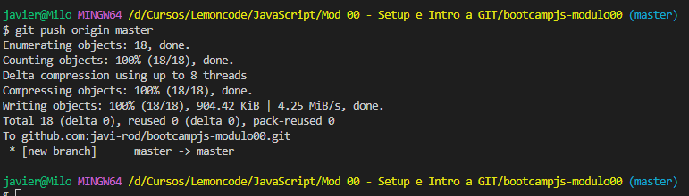

# Laboratorio Mod. 0 - GIT

1. Crear un repositorio en local

**_Inicio > Escribir Git Bash > Seleccionar Abrir_**

 
Ahora, nos dirigimos al directorio donde queremos crear el repositorio y creamos la carpeta.
 

Nos cambiamos al nuevo directorio

Antes de inicializar el repositorio, listamos el contenido del directorio y vemos que no contiene nada Después ejecutamos el comando **git init** y luego veremos que se ha creado un directorio oculto **.git**

2. Subir el repositorio a GitHub

En nuestro Dashboard de Github vamos a crear un nuevo repositorio, para ello tenemos dos formas de hacerlo.

Una forma es en **_Top Repositories_**, haciendo click en **_New_**

La otra forma es como vemos en la imagen

El nombre del repositorio debe coincidir con el nombre del repositorio local. Dejamos el proyecto en público para que pueda ser corregido y hacemos clic en **_Create repository_**

Ahora vamos a copiar la URL del repositorio creado para conectar el repositorio local.

Una vez tengamos la URL copiada, haremos uso del comando **_git remote add_** seguido de un alias (origin en este caso) y la URL

Para comprobar que la conexión se estableció haremos uso del comando **_git remote -v_** el cual va a listar los repositorios remotos

3. Hacer un commit y un push

Vamos a crear archivo README.md donde explicaremos los pasos seguidos y añadiremos imagenes para luego añadirlos al staging.

Si hacemos un git status primero, veremos que tenemos untrucked el archivo README.md y además el contenido del directorio imagenes que contiene las capturas de las explicaciones.

Para añadir el fichero y el contenido del directorio al staging ejecutaremos un **_git add ._**

Si hacemos, de nuevo, un **_git status_** veremos los ficheros que están listos para el commit

Ahora vamos a realizar el commit con **_git commit -m_** y un texto descriptivo

_git commit -m “Primer commit, añadir README.txt e imagenes”_

Después del commint vamos a enviar los datos de nuestro respositorio local al remoto usando el comando **_git push_**

_git push origin master_

Si ahora vamos al repo de Github y hacemos un F5 veremos los cambios

4. Crear una rama

Vamos a crear un nueva rama llamada development usando el siguiente comando

_git branch development_

Para cambiarnos a esa nueva rama debemos ejecutar lo siguiente

_git checkout development_

En esta nueva rama seguiremos editando el readme.txt y añadiendo imagenes pare despues hacer un commit.

En la nueva rama se añadieron nuevas imagenes que se añadieron al stagging y luego se hizo un commit

Los cambios se subieron a Github

Por último se fusionaron las ramas origin y development.

Nos cambios a la rama donde queremos hacer la fusión, en este caso master.

Una vez en master, hacemos el merge con la rama deveploment.

En este caso no hubo conflictos que resolver y el merge se hizo correctamente, por lo que se procedió hacer push a Github dando por finalizado el laboratorio.

